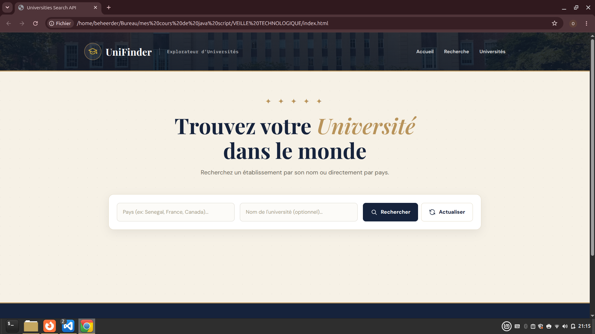
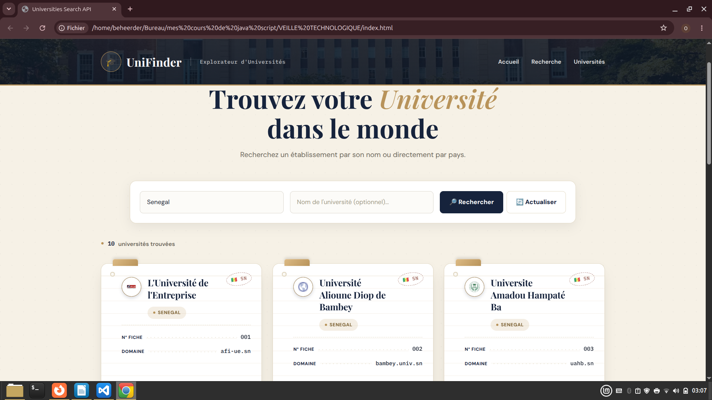
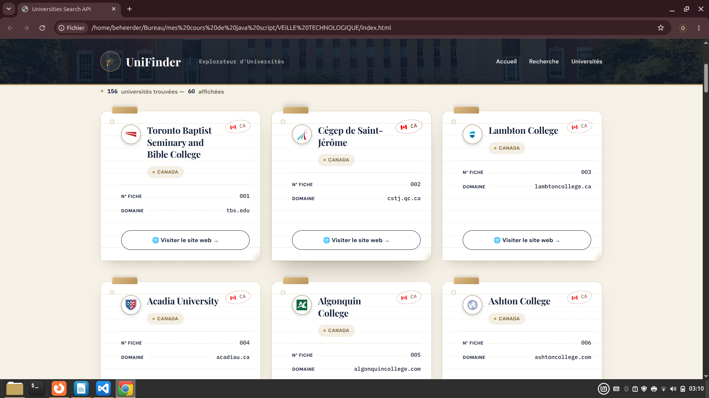
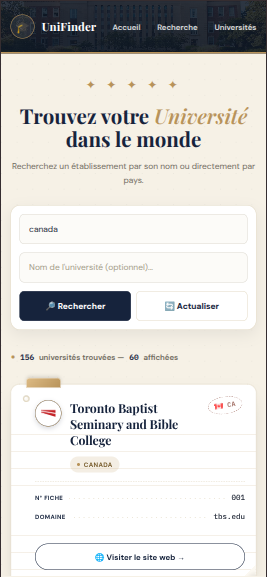

# 🎓 UniFinder — Explorateur d'Universités

**UniFinder** est une application web qui permet de rechercher et d'explorer des universités du monde entier par pays et/ou par nom, avec un design inspiré des fiches de catalogue de bibliothèque.

---

## 📡 API utilisée

**[Hipolabs Universities API](http://universities.hipolabs.com)**

- API publique, gratuite, **sans clé requise**
- Retourne pour chaque université : nom, pays, code pays ISO, domaine(s), site(s) web
- Endpoint utilisé (jeu de données complet, filtré côté client) :
  ```
  https://raw.githubusercontent.com/Hipo/university-domains-list/master/world_universities_and_domains.json
  ```

---

## ✨ Fonctionnalités développées

- 🔎 **Recherche par pays et/ou par nom d'université**, avec résultats filtrés en direct
- ⌨️ **Recherche en temps réel** (anti-rebond de 450 ms) en plus du bouton et de la touche Entrée
- 📄 **Pagination par lot** : affichage de 60 résultats à la fois, avec un bouton **"Voir plus"** qui apparaît uniquement s'il reste des résultats à charger
- 🗂️ **Mise en cache** des données en mémoire pour éviter de re-télécharger la liste à chaque recherche
- 🏳️ **Drapeaux automatiques** générés à partir du code pays ISO de chaque université
- 🎓 **Blason/logo** de chaque université, récupéré depuis le favicon de son site web, avec repli élégant sur une initiale stylée si l'image ne charge pas
- 💀 **Écrans de chargement animés** (fiches "fantômes") pendant la récupération des données
- ⚠️ **Gestion des erreurs réseau/API** avec message clair et bouton "Réessayer"
- 🈳 **Message dédié** en cas d'aucun résultat trouvé
- 🧭 **Navigation par ancres** (Accueil / Recherche / Universités) avec barre de navigation fixe
- 🔒 **Protection contre les failles XSS** (échappement systématique du contenu affiché)
- 📱 **Design entièrement responsive** (mobile, tablette, desktop)
- ♿ **Accessibilité** : attributs `aria-live`/`aria-busy`, focus clavier visible, respect de `prefers-reduced-motion`
- 🎨 **Design "fiche de catalogue"** : carte avec coin corné, onglet doré, perforation, tampon encré du pays, lignes pointillées façon sommaire

---

## 📸 Captures d'écran

> Ajoute tes captures d'écran dans un dossier `screenshots/` à la racine du projet, puis mets à jour les chemins ci-dessous.

| Page d'accueil                      | Résultats de recherche                  |
| ----------------------------------- | --------------------------------------- |
|  |  |

| Fiche université (détail)                             | Version mobile                    |
| ----------------------------------------------------- | --------------------------------- |
|  |  |

---

## 🗂️ Structure du projet

```
unifinder/
├── index.html      # Structure de la page
├── unifind.css      # Styles (thème catalogue de bibliothèque)
├── veille.js         # Logique JavaScript (fetch, filtrage, pagination, rendu)
└── screenshots/       # Captures d'écran 
```

---

## ⚙️ Installation et exécution

Aucune dépendance ni installation n'est nécessaire — c'est une application 100 % front-end (HTML / CSS / JavaScript natif).

### Option 1 — Ouverture directe

1. Cloner ou télécharger le projet :
   ```bash
   git clone https://github.com/Nilde64/unifinder.git
   cd unifinder
   ```
2. Double-cliquer sur `index.html` (ou l'ouvrir avec ton navigateur).

### Option 2 — Avec un serveur local (recommandé)

Certains navigateurs restreignent certaines fonctionnalités en ouverture directe (`file://`). Il est donc conseillé de lancer un petit serveur local :

**Avec l'extension VS Code "Live Server"**
1. Ouvrir le dossier du projet dans VS Code.
2. Clic droit sur `index.html` → **Open with Live Server**.

**Avec Python (déjà installé sur la plupart des systèmes)**
```bash
# Python 3
python -m http.server 8000
```
Puis ouvrir [http://localhost:8000](http://localhost:8000) dans le navigateur.

**Avec Node.js**
```bash
npx serve .
```

---

## 🛠️ Technologies utilisées

- HTML5
- CSS3 (variables CSS, Grid, Flexbox, animations)
- JavaScript (ES6+, `fetch`, `async`/`await`, Promises)
- [Hipolabs Universities API](http://universities.hipolabs.com)
- Polices Google Fonts : *Playfair Display*, *DM Sans*, *IBM Plex Mono*

---

## 👥 Auteur(s)

Projet académique — SUP'INFO Dakar, Module JavaScript Avancé, Licence 2.

---

## 📄 Licence

Projet réalisé dans un cadre pédagogique.